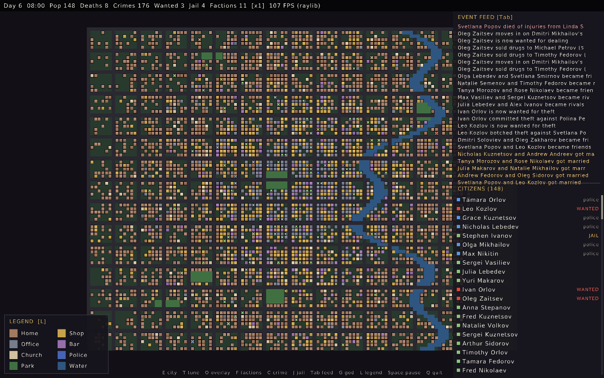
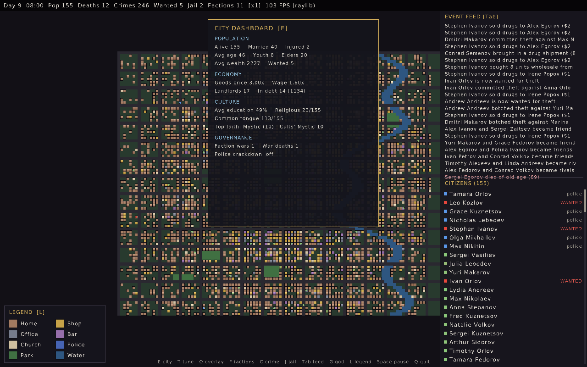
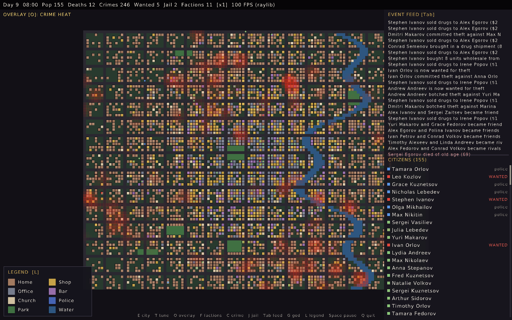

# 🏙️ Emergent City

> A living-city simulation. 150 citizens with personalities, needs, families, jobs, faiths and rap sheets — dropped into a procedural city where **nothing is scripted**. You watch the stories happen: marriages and murders, drug empires and turf wars, immigrant families, gang feuds, crackdowns, and citizens who grow up, grow old, and die.




*Day 6 of a 150-citizen city. The feed on the right is unscripted — drug deals, new friendships and rivalries, a death from injuries, five marriages in one morning.*

---

## What is this?

Each citizen is a little agent with a **Big-Five personality + traits**, a set of **needs** (hunger, energy, safety, social, meaning, belonging, money), a **memory**, and a **web of relationships**. A fast utility-AI drives their moment-to-moment choices; an optional LLM is consulted only for rare narrative turning points. Everything else — the crime, the economy, the demographics — **emerges** from those agents interacting.

You just watch. (Unless you flip on **God Mode**.)

This repo has two implementations:

- **`csim/` — a from-scratch C port, and the primary, actively-developed version.** Dependency-light, deterministic, fast (150 agents at hundreds of FPS), rendered in a raylib GPU window. **Everything below describes `csim`.**
- **Python / pygame prototype** (repo root: `main.py`, `agents/`, `world/`, …) — the original it was ported from.

---

## What's simulated

A city's worth of interacting systems, all emergent from the agents:

- **🧠 Agents & AI** — Big-Five personality + unique traits, seven needs, memory, a relationship graph (affinity + familiarity → friends, rivals, marriages). Utility-AI for ~85% of behavior; optional **Qwen/OpenRouter LLM** for the narrative 15%.
- **🔪 Crime underworld** — career criminals, street **dealers**, **kingpins**, and rare latent **serial killers**. A real drug economy (kingpin import → wholesale → street sales to addicts), **turf wars** and retaliation when dealers poach, career **escalation** (theft → burglary → robbery → arson), `wanted` heat, arrests, and **jail gangs** that settle scores behind bars. Assaults cause **injuries** you can die of or pay to **treat**.
- **⚔️ Factions & warfare** — gangs and cults recruit members and hold **turf**. Rival factions **declare war**, their soldiers hunt each other through a shared **combat** system, casualties mount, and truces are called. (Warfare is strictly faction-vs-faction — it's a city, not a nation.)
- **⚖️ Law & justice** — police patrol and arrest; a crime surge triggers a temporary **crackdown**; repeat offenders get **longer sentences**. Arrests go through a **justice system** (on by default): a **trial** decides conviction vs **acquittal**, the wealthy can **bribe** a corrupt force, and innocents are occasionally **wrongfully convicted** — with **corruption** and **oversight** knobs that make the law unjust *and* correctable. The **police force itself scales with public funding**: tax-funded police budgets **hire more officers** and raise the **catch rate**, so a well-funded city visibly suppresses crime.
- **💰 Economy** — occupations, wages that track the cost of living, **goods-price inflation**, a **landlord class** that owns homes and collects **rent** (property is **inherited** on death — to a child, spouse, or the wealthiest heir — so the class persists and **concentrates** across generations), **credit** (micro-loans, interest, debt that drags down your status), and a per-worker **craft skill** that grows by working so experienced, educated hands earn more.
- **🏅 Reputation & status** — a civic standing that work and worship raise and crime lowers, feeding into social **tiers and titles** (Destitute → Magnate, Officer, Kingpin, Notorious…).
- **🏙️ Socioeconomic diversity** — income stratified by **occupation** pay tiers (`--occ-pay-spread`, **on by default**) on top of skill/education drift; **households** with a real net income across multiple earners; crime whose **loot scales with the target's wealth** and whose offenders pick marks by **expected value** (`--crime-wealth`, **on by default** — rob a mansion for a real score, a tenement for pennies). Opt-in extras: **rich & poor neighbourhoods** that emerge from wealth-based residential sorting (`--neighborhoods`, with an **AFFLUENCE** map overlay) and then **gentrify or decline** as fortunes shift and families **move house**, plus a **`--police-bias crime\|money\|balanced`** knob that decides whether policing protects the wealthy (displacing crime to poor blocks) or chases the heat. Surfaced on the dashboard as **Gini**, income distribution, segregation, mobility and loot-by-wealth.
- **🏛️ Governance & balance (on by default)** — a city that counterbalances its own inequality, without erasing its poor. **Progressive taxation** funds a public treasury: marginal **income-tax brackets** (low earners exempt, top earners pay most) plus a progressive-tiered **wealth (stock) tax** that trims the top where inequality actually lives. The treasury funds a **subsistence welfare floor** (keeps a real poor class alive without bunching everyone into the middle), **policing** and **schools**. **Source caps** moderate wealth concentration *at the source*: **rent is capped** to a share of a tenant's income (nobody pays rent they can't afford — chokes the landlord channel), and a **debt-interest cap** keeps a bad patch from compounding into a debt trap. **Economic stabilizers** (counter-cyclical interest/price dampers — on by default; an unconditional survival-**benefit** floor is available via `--benefit` but off by default, so relief is tax-funded welfare, not a handout) and always-on **stability guardrails** (destitution / depopulation / crime-spiral / inflation detectors with a HUD warning) round it out. The default run lands **Gini in a healthy band with the pyramid intact and ~zero destitution**; every piece is a tunable knob (`--welfare`, `--wealth-tax-rate`, `--rent-cap`, `--debt-rate`, …) and the whole stack is disable-able (`--no-taxation`, `--no-source-caps`, `--no-justice`, `--no-stabilizers`). Deferred: guardrail auto-correction and disasters (fire/flooding).
- **🌍 Culture** — religions, cultural groups, languages and **education**. Friendships form along cultural lines (a shared tongue bonds, a language barrier strains), the devout draw meaning from worship, and culture **spreads by contact**: the young get schooled, searching souls convert to a friend's faith, minorities assimilate into the common tongue.
- **🔬 Knowledge & technology** — educated scholars accrue **research** into **theories**, which unlock a chain of **technologies** (writing, tooling, medicine, banking, printing, civics) that **diffuse** through the city and modestly lift wages, healing, interest, research and policing as they're adopted.
- **👶 Life cycle** — courtship → **marriage** → **children** who inherit the family's culture and faith; citizens **age** through life stages (Child → Youth → Adult → Elder) and eventually **die of old age**. Immigration brings young families so the city's age pyramid stays healthy. Click a citizen and press **`K`** to walk their **family tree** (parents, spouse, children, siblings). The whole pace is tunable.
- **👁️ Perception (opt-in)** — turn on **field of view** and agents only witness crimes / spot fugitives they can actually *see* (line-of-sight blocked by buildings), so crime goes stealthy in blind spots. Add **hearing** and loud acts — gunshots, brawls, arson, riots — still carry *around corners*, while a quiet pickpocket doesn't (serial killers are quieter still). The two together make a realistic cat-and-mouse.
- **🌦️ Weather (opt-in)** — deterministic **temperature, rain and fog** (`--weather`), driven by coherent noise over time (its own cycle via `--weather-period`), so it's a pure function of the seed and never perturbs the sim. It's **mechanical**: fog shortens sight and rain masks sound, so **storms are crime cover** (more gets away) — and cold snaps bring **heating costs that hit the poor hardest** (a cheap, badly-insulated home pays more), pushing them toward debt. HUD readout + ambient tint, and `temp/rain/fog` on the dashboard to correlate with crime and deaths.
- **🗺️ Pathfinding & worldgen** — agents navigate with grid **A\*** + **Jump Point Search**, routing **around water** instead of walking over it. The city is generated with coherent **FastNoiseLite** noise (organic lakes and neighbourhoods) **by default**; pass `--no-noise-worldgen` for the legacy sine-river/district-gradient map.
- **🎲 Determinism** — the core is a deterministic PCG32 sim with a fixed timestep; a run is **bit-for-bit reproducible from its seed** (headless, or the GUI with `--fixed-step`, LLM off). Binary save/load snapshots the whole world.
- **⏺️ Record, replay & fork** — record a whole session (`--record`): the seed, config and the tick-stamped timeline of your live interventions (tuning changes, god-mode actions). Replay it **byte-for-byte** (a final-state checksum proves it), re-run it anywhere with `--replay-session`, or **archive it to OpenSearch** (via Data Prepper) and recall it with `--replay-session os:<id>`. In the GUI you can watch a recorded run play back, and the moment you tweak a value it **forks** a new deterministic timeline that's itself recorded.



*The city dashboard (press `E`): population, economy, culture and governance at a glance — here an elder has just died of old age at 69.*

---

## Build & run

`csim` builds with CMake and fetches raylib automatically. You need a C compiler and the usual GL/X11 dev headers; `libcurl` + `libcjson` are optional (for the LLM).

```bash
# dev headers (Debian/Ubuntu): raylib needs these
sudo apt install build-essential cmake libgl1-mesa-dev xorg-dev \
     libxrandr-dev libxinerama-dev libxcursor-dev libxi-dev
# optional, for LLM consults:
sudo apt install libcurl4-openssl-dev libcjson-dev

cd csim
cmake -B build -S .
cmake --build build

./build/csim            # the GPU window
./build/csim --help     # every flag, env var and control, with examples
./build/csim_headless   # run the core and print a report (no graphics, no deps)
```

> On **WSL**, run GUI apps with `export DISPLAY=:0` (WSLg provides the X server).

---

## Controls

| | |
|---|---|
| **drag / wheel** | pan + zoom |
| **click a citizen** | open the inspector (needs, family, job, rap sheet, culture…) |
| **1–6** | sim speed 1×–6× |
| **Space** | pause |
| **E** | city dashboard |
| **K** | family tree of the selected citizen (click a relative to jump) |
| **T** | live tuning panel (change settings while it runs) |
| **O** | cycle map overlays: crime-heat, faction-turf + war lines, culture, vision, hearing |
| **F / J / C** | factions / jail roster / crime watch |
| **Tab / L** | event feed / legend |
| **G** | God Mode (`1`–`8` select a tool: smite, bless, spawn, incite riot…) |
| **a** | Dwarf-Fortress ASCII render mode |
| **q / Esc** | quit |



*Crime-heat overlay (`O`): hotspots glow where crime concentrates. Other overlays tint gang turf (with pulsing war lines between warring factions) or recolor citizens by cultural group.*

---

## Configuration

Most sim parameters are flags **and** environment variables **and** live-adjustable in the `T` panel while running:

```bash
./build/csim --pop-target 250 --years-per-day 4      # bigger city, faster life cycle
./build/csim --vision --hearing                      # perception on: stealthy, cat-and-mouse crime
./build/csim --weather --vision --hearing            # storms as crime cover; fog/rain reduce witnesses
./build/csim --neighborhoods --police-bias money     # opt-in: rich/poor blocks + biased policing (pay tiers & wealth-scaled crime are already on)
./build/csim --biomes --neighborhoods                # terrain biomes shape value (noise map is default)
./build/csim --no-taxation --no-source-caps --no-justice --no-stabilizers --no-crime-wealth  # raw ungoverned city (governance is on by default)
./build/csim --welfare 0.5 --wealth-tax-rate 0.1 --rent-cap 0.25   # tune the balance knobs
./build/csim --fixed-step                            # deterministic, reproducible run
./build/csim --record run.sess                       # record for byte-identical replay / archive
./build/csim --family-share 0.6 --family-kids-max 5  # more children
./build/csim --production 2 --research-rate 0.1      # skill matters more; faster tech
CSIM_WARMDAYS=12 ./build/csim --pop-target 250       # open on an already-grown city
CSIM_SHOT=out.png ./build/csim                       # render one frame to ./out.png and exit
./build/csim --tileset dawnlike                      # sprite tileset instead of blocks
```

Run `./build/csim --help` for the full, categorized list (aging pace, population target, family demographics, perception, worldgen, knowledge/production, timestep/determinism, rendering, screenshots, LLM, …).

### Balance dashboard

Pass `--metrics <path.csv>` (GUI or headless) to log a CSV row with every aggregate the
city tracks — population by life stage, births/deaths, economy (incl. cumulative legal
income from wages vs. illegal income from crime, and per-crime proceeds), every crime
kind, knowledge/tech adoption, culture, factions/wars — once per game-day, or finer with
`--metrics-every <game-hours>` / `--metrics-hourly` (rows carry a fractional-day `t`
column). A static, auto-refreshing web dashboard in [`tools/dashboard/`](tools/dashboard/)
(vendored Chart.js, no build step) polls that CSV and redraws its charts live — no page
reload — for both live runs and replays; **click any chart to enlarge** it. A **parameters
panel** at the top reads the run's manifest and lists, at a glance, the settings behind the
displayed data — split into *world (set at creation)* vs *tunable (live)* — so you always
know what config produced the graphs. Headless can
**replay** a past run two ways: `--replay old.csv` (stream it back so the graphs animate)
or `--rerun old.csv.meta` (deterministically reproduce it). Serve it with any static host;
see [the dashboard README](tools/dashboard/README.md) for nginx notes.

### Reproducibility

The simulation is deterministic given a seed. **Headless** runs are bit-identical by default; the **GUI** is real-time-paced (variable timestep) by default, so pass **`--fixed-step`** to make it reproducible and frame-rate-independent. In both cases the **LLM must be off** for strict reproducibility (it's an async network call), and floating-point identity holds within one build/machine.

### Record, replay & archive

`--record <file>` captures a session as its **seed + config + a tick-stamped timeline of your live interventions** (tuning changes, god-mode actions) — no per-tick state dumps, just the inputs, because the sim is deterministic. Replay it byte-for-byte and have it self-verify against a final-state checksum:

```bash
./build/csim --record run.sess                       # record a GUI session (forces --fixed-step)
./build/csim_headless --replay-session run.sess      # re-run deterministically; asserts the checksum
./build/csim --replay-session run.sess               # watch it play back; edit a value to FORK a new timeline
```

Set `CSIM_OS_INGEST_URL` (an OpenSearch/Data-Prepper endpoint) and the session — plus its per-day metrics — is **archived to OpenSearch**; recall and replay it anywhere with `--replay-session os:<session_id>` (`CSIM_OS_QUERY_URL`/`CSIM_OS_USER`/`CSIM_OS_PASS`). Weather and all opt-in systems are part of the recorded config, so a replay reproduces the exact weather timeline too.

### LLM (optional)

Set `OPENROUTER_API_KEY` / `OPENROUTER_BASE_URL` (e.g. in a `.env`) to let citizens occasionally consult a model (Qwen works well) for big narrative decisions. Without a key, the rule-based AI handles everything.

---

## How it stays cheap

Calling an LLM for every agent every tick would be ruinous, so behavior is a **hybrid**: a free, deterministic **utility-AI** scores every agent's actions each tick, and the **LLM is consulted only on rare, important moments** (a betrayal, a conversion, a crisis) with rate-limiting. The result is a city that runs at hundreds of FPS and still has narrative texture.

---

## License

MIT.

## Credits

A C port and heavy expansion of the original Python *Emergent City* concept — built to watch a city live, feud, and grow old on its own. Inspired by Dwarf Fortress, The Sims, RimWorld, and every emergent-narrative game.
